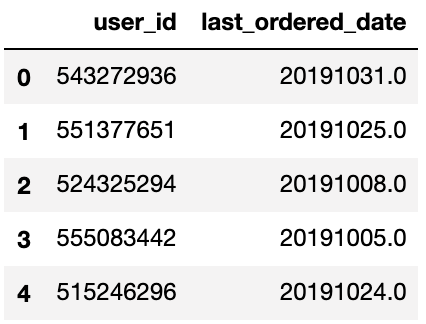
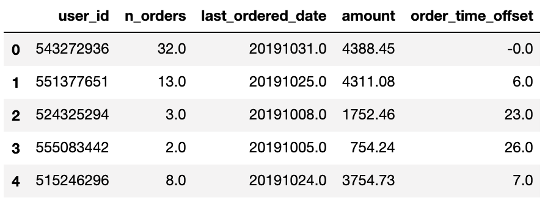

# Кластеризация пользователей по лояльности с помощью метода RFM

## Тизер

Типичный лог ивентов преобразовывается в RFM анализ, чтобы ответить на вопрос: "<ins>**Как заставить пользователей покупать чаще?**</ins>".

## Откуда взялись данные?

Kaggle крут не только своими соревнованиями, но и своим комньюнити. <a href="https://www.kaggle.com/mkechinov">*Michael Kechinov*<a/> выложил огромный датасет (13.67 GB) c данными о ивентов пользователей на ecommerce сайте. Я взял только часть этих данных за октябрь (5.26 GB), поскольку у меня нет кластера компьютеров, чтобы обработать все данные. <a href="https://www.kaggle.com/mkechinov/ecommerce-behavior-data-from-multi-category-store">Ссылка на датасет<a/>

## Отбор нужных ивентов

Полный код можно посмотреть <a href="https://nbviewer.jupyter.org/github/ArthurBodrov/RFM-client-analysis/blob/main/Notebooks/Filtering%20log%20events.ipynb">тут<a/>. 

 

Моему макбуку будет сложно проанализировать все данные в дата сете. Поэтому я выбрал только категорию `smartphones` с ивентом `purchase`.

До фильтра было **42_448_764 rows** , после фильтрации стало **338_018 rows**. Отобрали из 5,28 GB данных 27 MB нужных. Двигаемся дальше.

Получившиеся данные:
 

## Чистка и обработка данных

Я разделил отбор данные и обработку на 2 разных ноутбука. В первым, я отбрал нужные мне ивенты. Во втором делаю кластеризацию пользователей. Чтобы посмотреть полный код, этих этапов зайдите <a href="https://nbviewer.jupyter.org/github/ArthurBodrov/RFM-client-analysis/blob/main/Notebooks/Data%20Cleaning.ipynb">сюда<a/>. 

### Чистка

Проверим, если ли данные с `null`.

```python
# In
round((smartphones.isnull().sum() / smartphones.shape[0]) * 100, 2)

# Out
event_time     0.0
event_type     0.0
category_id    0.0
price          0.0
user_id        0.0
dtype: float64

```

Данные чистые. Заполнять искусственно не нужно.

### Подготовка данных

 

Сейчас данные в формате лога. Такого числа в столько-то секунд пользователь с айди такой-то купил определенный смарфон. Преобразуем лог в *RFM* вид, для анализа пользователей. Начнем с даты.

От часов, минут и секунд в фичи `event_time` можно избавиться, поскольку в нашем случае они не сыграют огромной роли.

Переформатируем дату в формат `YYYYMMDD`.

```python
smartphones['event_time'] = pd.to_datetime(smartphones['event_time'])

smartphones['event_time'] = smartphones['event_time'] \
    .map(lambda x: 10000*x.year + 100*x.month + x.day)

smartphones = smartphones.rename(columns={'event_time': 'event_date'})
```

|Было|Стало|
|---|---|
|  |  |

Полный вывод:
 

`category_id` и `event_type` уже не понадобятся, дропнем их.

 

#### RFM

Как я уже сказал, для кластеризации пользователей я буду использовать сегментацию **RFM**.

> **RFM** (**R**ecency **F**requency **M**onetary) - разделение клиентов на сегменты от степени их лояльности. 
> 
> У такой сегментации всего 3 колонки:
> 
>**R**ecency (давность) - давность прошлой сделки, сколько времени прошло с прошлой покупки. Предполагается, чем меньше эта метрика, тем больше вероятность будущей, повторной покупки.
>
>**F**requency (частота) - кол-во покупок. Больше покупок, больше вероятность возвращение клиента.
>
>**M**onetary (денежная масса, деньги) - сумма сделок. Чем больше потратил клиент, тем больше вероятность возвращение клиента.


### Трансформация данных в RFM

Отберем уникальных юзеров.

```python
users = pd.DataFrame({'user_id': smartphones['user_id'].unique()})

```
 

Их кстати **160_437** штук.

**R**ecency (давность) - давность прошлой сделки. 

Recency = Текущий день -(минус) последняя сделка пользователя. 

**Примечание:** в моем случае "Текущий день" = 31 октября 2019.

Найдем дату последней покупки у каждого пользователя.

```python
last_ordered_date = smartphones.groupby(['user_id'])['event_date'].agg('max')

zipped_last_ordered_date = zip(n_orders.index, n_orders.values)

for index, value in zipped_last_ordered_date:
    users.loc[users['user_id'] == index, 'last_ordered_date'] = value
```

 

Вычислим количество, сделанных покупок каждым пользователем.

```python
n_orders = smartphones.groupby(['user_id']).agg('count')['price']

zipped_n_orders = zip(n_orders.index, n_orders.values)

for index, value in zipped_n_orders:
    users.loc[users['user_id'] == index, 'n_orders'] = value
```

 

Просуммируем цены заказов, чтобы получить `Monetary`.

```python
amount = smartphones.groupby(['user_id'])['price'].agg('sum')

zipped_amount = zip(amount.index, amount.values)

for index, value in zipped_amount:
    users.loc[users['user_id'] == index, 'amount'] = value
```

 

И так последний штрих в вычислениях. Нужно  преобразовать `last_ordered_date` в `recency`,  то есть вычесть самый-самый последний день, указанные в данных **(20191031)**, из последнего совершения покупки определенного клиента.

```python
max_date = smartphones['event_date'].max()

users['order_time_offset'] = max_date - users['last_ordered_date'])
```
 

Дропнем уже ненужную колонку `last_ordered_date`.

```python
users = users.drop('last_ordered_date', axis=1)
```

Все готов для RFM. Наведем красоту: переименуем колонки, упорядочим, уберем точку из значений, закастив их к типу `int`. И получим такой результат:
 

## Визуализация

Посмотрим на распределение и выбросы фич. Отобразим гистограмму, QQPlot и Boxplot.

 
 
 

Распределение ненормальное и много выбросов у `Recency` и `Monetary`. 

## Скалирование величин.
У многих алгоритмы кластеризации под капотом вычисляют дистанции (Euclidean, Manhattan). Поэтому скалирование величин **обязательный** гость программы.

Я буду использовать `StandardScaler`, поскольку потом я собираюсь удалить выбросы. 

```python
from sklearn.preprocessing import StandardScaler

scaler = StandardScaler()

for column in rfm.columns:
    rfm[column] = scaler.fit_transform(rfm[[column]])

rfm_scaled = rfm.copy()
```

 

## Удаление выбросов.

`StandardScaler` это тоже самое, что и z-score. По правилу трех сигм, наблюдения, которые лежат дальше +-3σ, это выбросы.

```python
for column in rfm.columns:
    rfm_scaled = rfm_scaled[(rfm_scaled[column] < 3) & (rfm_scaled[column] > -3)]
```

После скалирование распределение стало лучше.
 

В 3d проекции данные выглядят так:

 

## Тренировка модели

В качестве модели, я буду использовать простой и быстрый алгоритм Kmeans.

Для нахождения количества кластеров, я воспользую методом `Elbow`.

```python
results = []
range_clust = range(2, 15)

for num in range_clust:
    kmeans = KMeans(n_clusters=num)
    kmeans.fit(rfm_scaled)
    
    results.append({'N_clusters': num, 'Inertia': kmeans.inertia_})
results = pd.DataFrame(results)
```

Результат получился такой:

 

***По методу Elbow выбираем ответ 4.*** 


```python
kmeans_elbow = KMeans(n_clusters=4)
kmeans_elbow.fit(rfm_scaled)

rfm_scaled['Cluster_id'] = kmeans_elbow.labels_

# Прибавляю 1, чтобы счет начинался с 1 кластера, не с нулевого кластера 
rfm_scaled['Cluster_id'] = rfm_scaled['Cluster_id'] + 1
```

 

## Визуализация кластеризации

 