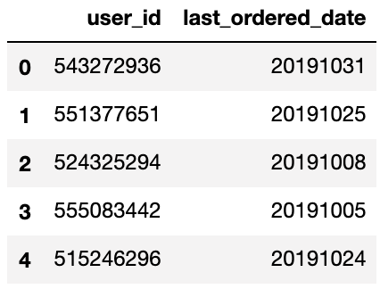

# RFM custromer cluster analysis

## Откуда взялись данные?

Kaggle крут не только своими соревнованиями, но и своим комньюнити. <a href="https://www.kaggle.com/mkechinov">*Michael Kechinov*<a/> выложил огромный датасет (13.67 GB) c данными о ивентов пользователей на ecommerce сайте. Я взял часть этих данных за октябрь (5.26 GB), поскольку у меня нет кластера компьютеров, чтобы обработать все данные. <a href="https://www.kaggle.com/mkechinov/ecommerce-behavior-data-from-multi-category-store">Ссылка на датасет<a/>

## Отбор нужных ивентов

Полный код можно посмотреть <a href="https://nbviewer.jupyter.org/github/ArthurBodrov/RFM-client-analysis/blob/main/Notebooks/Filtering%20log%20events.ipynb">тут<a/>. 

 

Моему макбуку будет сложно проанализировать все данные в дата сете. Поэтому я выбрал только категорию `smartphones` с ивентом `purchase`.

До фильтра было **42_448_764 rows** , после фильтрации стало **338_018 rows**. Отобрали из 5,28 GB данных 27 MB нужных. Двигаемся дальше.

Получившиеся данные:
 

## Чистка и обработка данных

Я разделил отбор данные и обработку на 2 разных ноутбука. В первым, я отбрал нужные мне ивенты. Во втором делаю кластеризацию пользователей. Чтобы посмотреть полный код, этих этапов зайдите <a href="https://nbviewer.jupyter.org/github/ArthurBodrov/RFM-client-analysis/blob/main/Notebooks/Data%20Cleaning.ipynb">сюда<a/>. 

### Чистка

Проверим, если ли данные с `null`.

```python
# In
round((smartphones.isnull().sum() / smartphones.shape[0]) * 100, 2)

# Out
event_time     0.0
event_type     0.0
category_id    0.0
price          0.0
user_id        0.0
dtype: float64

```

Данные чистые. Заполнять искусственно не нужно.

### Подготовка данных

 

Сейчас данные в формате лога. Такого числа в сколько-то секунд пользователь с айди такой-то купил определенный смарфон. Преобразуем лог в *RFM* вид, для анализа пользователей. Начнем с даты.

От часов, минут и секунд в фичи `event_time` можно избавиться, поскольку в нашем случае они не сыграют огромной роли.

Переформатируем дату в формат `YYYYMMDD`.

```python
smartphones['event_time'] = pd.to_datetime(smartphones['event_time'])

smartphones['event_time'] = smartphones['event_time'] \
    .map(lambda x: 10000*x.year + 100*x.month + x.day)

smartphones = smartphones.rename(columns={'event_time': 'event_date'})
```
 

`category_id` и `event_type` уже не понадобятся, дропнем их.

 

#### RFM

Как я уже сказал, для кластеризации пользователей я буду использовать сегментацию **RFM**.

**RFM** (**R**ecency **F**requency **M**onetary) - разделение клиентов на сегменты от степени их лояльности.

У такой сегментации всего 3 колонки:

**R**ecency (давность) - давность прошлой сделки, сколько времени прошло с прошлой покупки. Предполагается, чем меньше эта метрика, тем больше вероятность будущей, повторной покупки.

**F**requency (частота) - кол-во покупок. Больше покупок, больше вероятность возвращение клиента.

**M**onetary (денежная масса, деньги) - сумма сделок. Чем больше потратил клиент, тем больше вероятность возвращение клиента.

### Трансформация данных в RFM

Отберем уникальных юзеров.

```python
users = pd.DataFrame({'user_id': smartphones['user_id'].unique()})

```
 

Их кстати **160_437** штук.

**R**ecency (давность) - давность прошлой сделки. 

Recency = Текущий день -(минус) последняя сделка пользователя. 

**Примечание:** в моем случае "Текущий день" = 31 октября 2019.

Найдем дату последней покупки у каждого пользователя.

```python
for user in users['user_id']:
    users.loc[users['user_id'] == user, 'last_ordered_date'] = \
    smartphones[smartphones['user_id'] == user]['event_date'].iloc[-1]
# использую `.iloc[-1]` из-за упорядоченности данных, последняя покупка = последняя запись
```

 

Тип `last_ordered_date` - float, приведем к типу `int`

```python
users['last_ordered_date'] = users['last_ordered_date'].astype(int)
```

 
