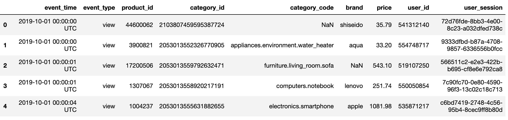
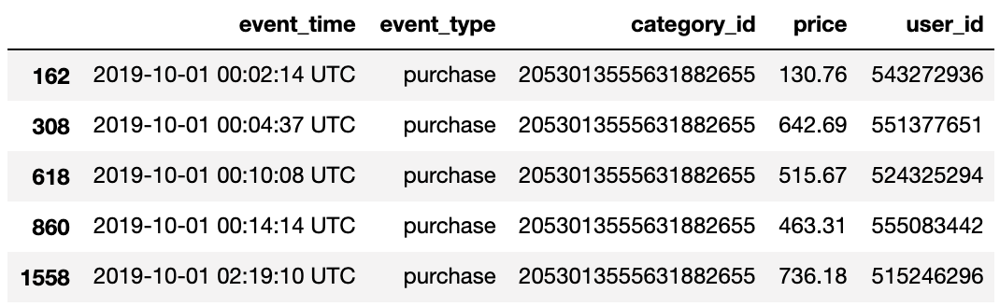
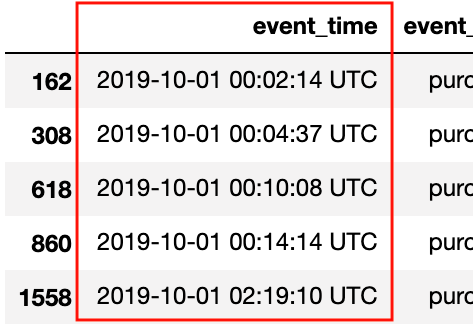
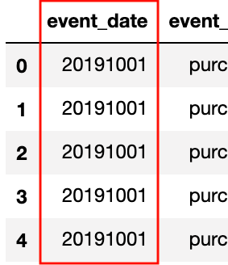
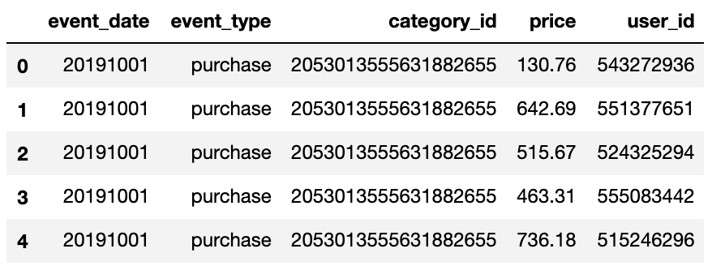
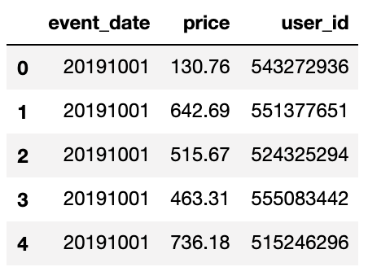
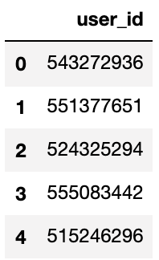
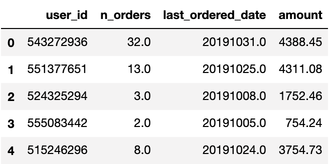
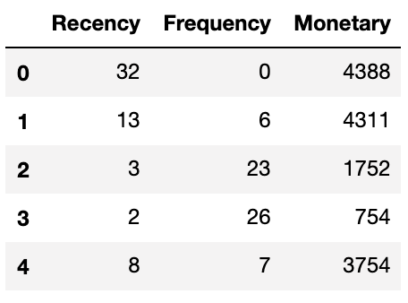

# Кластеризация пользователей по лояльности с помощью метода RFM

## О чем проект?

Сервисы IT собирают тонны логов каждую секунду о действиях пользователей. В сыром виде они не интересны. Но с помощью них вытачиваются инсайты.

В этом проекте я преобразовываю типичный, невзрачный лог о действиях пользователей интернет-магазина в RFM шкалу, **R**ecency **F**requency **M**onetary. RFM - средство для оценки лояльности клиентов. Лояльности поможет разделить клиентов на кластеры и ответить на вопросы - "<ins>Как вернуть пользователей, увеличить частоту покупок, увеличить средний чек?</ins>".


## Откуда взялись данные?

Kaggle крут не только своими соревнованиями, но и своим комньюнити. <a href="https://www.kaggle.com/mkechinov">*Michael Kechinov*<a/> выложил огромный датасет (13.67 GB) c данными о ивентов пользователей на ecommerce сайте. Поскольку у меня нет кластера компьютеров, чтобы обработать все данные, я взял только часть этих данных за октябрь (5.26 GB). <a href="https://www.kaggle.com/mkechinov/ecommerce-behavior-data-from-multi-category-store">Ссылка на датасет<a/>

## Отбор нужных ивентов

Полный код можно посмотреть <a href="https://nbviewer.jupyter.org/github/ArthurBodrov/RFM-client-analysis/blob/main/Notebooks/Filtering%20log%20events.ipynb">тут<a/>. 

Первоначально вид данных:

 

Моему макбуку будет сложно проанализировать все данные в дата сете. Поэтому я выбрал только категорию `smartphones` с ивентом `purchase`.

До фильтра было **42_448_764 rows**, после фильтрации и удаления ненужных колонок стало **338_018 rows**. Отобрали из 5,28 GB данных 27 MB нужных. Двигаемся дальше.

Получившиеся данные:
 

## Чистка и обработка данных

Я разделил отбор данные и обработку на 2 разных ноутбука. В первым, я отбрал нужные мне ивенты (все, что можно увидеть выше 
этого предложения). Во втором делаю кластеризацию пользователей. Чтобы посмотреть полный код кластеризации, зайдите <a href="https://nbviewer.jupyter.org/github/ArthurBodrov/RFM-client-analysis/blob/main/Notebooks/Data%20Cleaning.ipynb">сюда<a/>. 

### Чистка

Проверим, если ли данные с `null`.

```python
# In
round((smartphones.isnull().sum() / smartphones.shape[0]) * 100, 2)

# Out
event_time     0.0
event_type     0.0
category_id    0.0
price          0.0
user_id        0.0
dtype: float64

```

Данные чистые. Заполнять искусственно не нужно.

### Подготовка данных

 

Сейчас данные в формате лога. 
> Такого числа в столько-то секунд пользователь с айди такой-то купил определенный смартфон. 

Преобразуем лог в *RFM* вид, для анализа пользователей. Начнем с даты.

От часов, минут и секунд в фичи `event_time` можно избавиться, поскольку в нашем случае они не сыграют огромной роли.

Переформатируем дату в формат `YYYYMMDD`.

```python
smartphones['event_time'] = pd.to_datetime(smartphones['event_time'])

smartphones['event_time'] = smartphones['event_time'] \
    .map(lambda x: 10000*x.year + 100*x.month + x.day)

smartphones = smartphones.rename(columns={'event_time': 'event_date'})
```

|Было|Стало|
|---|---|
|  |  |

Полный вывод:
 

`category_id` и `event_type` уже не понадобятся, дропнем их.

 

#### RFM

Как я уже сказал, для кластеризации пользователей я буду использовать сегментацию **RFM**.

> **RFM** (**R**ecency **F**requency **M**onetary) - разделение клиентов на сегменты от степени их лояльности. 
> 
> У такой сегментации всего 3 колонки:
> 
>**R**ecency (давность) - давность прошлой сделки, сколько времени прошло с прошлой покупки. Предполагается, чем меньше эта метрика, тем больше вероятность будущей, повторной покупки.
>
>**F**requency (частота) - кол-во покупок. Больше покупок, больше вероятность возвращение клиента.
>
>**M**onetary (денежная масса, деньги) - сумма сделок. Чем больше потратил клиент, тем больше вероятность возвращение клиента.


### Трансформация данных в RFM

Отберем уникальных юзеров.

```python
users = pd.DataFrame({'user_id': smartphones['user_id'].unique()})

```
 

Уников кстати **160_437** штук.

#### Recency
___

**R**ecency (давность) - давность прошлой сделки. 

Recency = `current_date` - `last_ordered_date`. 

**Примечание:** в моем случае `current_date` = 31 октября 2019.

Найдем дату последней покупки у каждого пользователя.

```python
last_ordered_date = smartphones.groupby(['user_id'])['event_date'].agg('max')

zipped_last_ordered_date = zip(n_orders.index, n_orders.values)

for index, value in zipped_last_ordered_date:
    users.loc[users['user_id'] == index, 'order_time_offset'] = value - 20191031
```

 

#### Frequency
___

Вычислим количество, сделанных покупок каждым пользователем.

```python
n_orders = smartphones.groupby(['user_id']).agg('count')['price']

zipped_n_orders = zip(n_orders.index, n_orders.values)

for index, value in zipped_n_orders:
    users.loc[users['user_id'] == index, 'n_orders'] = value
```

 

#### Monetary
___

Просуммируем цены заказов, чтобы получить `Monetary`.

```python
amount = smartphones.groupby(['user_id'])['price'].agg('sum')

zipped_amount = zip(amount.index, amount.values)

for index, value in zipped_amount:
    users.loc[users['user_id'] == index, 'amount'] = value
```

 

Все готов для RFM. Наведем красоту: переименуем колонки, дропнем `user_id`, упорядочим, уберем точку из значений, закастив их к типу `int`. И получим такой результат:
 

## Визуализация

Посмотрим на распределение и выбросы фич. Отобразим гистограмму, QQPlot и Boxplot.

 
 
 

Распределение ненормальное и много выбросов у `Recency` и `Monetary`. 

## Скалирование величин.
У многих алгоритмы кластеризации под капотом вычисляют дистанции (Euclidean, Manhattan). Поэтому скалирование величин **обязательный** гость программы.

Я буду использовать `StandardScaler`, поскольку потом я собираюсь удалить выбросы. 

```python
from sklearn.preprocessing import StandardScaler

scaler = StandardScaler()

for column in rfm.columns:
    rfm[column] = scaler.fit_transform(rfm[[column]])

rfm_scaled = rfm.copy()
```

 

## Удаление выбросов.

`StandardScaler` это тоже самое, что и z-score. По правилу трех сигм, наблюдения, которые лежат дальше +-3σ, это выбросы.

```python
for column in rfm.columns:
    rfm_scaled = rfm_scaled[(rfm_scaled[column] < 3) & (rfm_scaled[column] > -3)]
```

После скалирование распределение стало лучше.
 

В 3d проекции данные выглядят так:

 

## Тренировка модели

В качестве модели, я буду использовать простой и быстрый алгоритм Kmeans.

Для нахождения количества кластеров, я воспользую методом `Elbow`.

```python
results = []
range_clust = range(2, 15)

for num in range_clust:
    kmeans = KMeans(n_clusters=num)
    kmeans.fit(rfm_scaled)
    
    results.append({'N_clusters': num, 'Inertia': kmeans.inertia_})
results = pd.DataFrame(results)
```

Результат получился такой:

 

***По методу Elbow выбираем ответ 4.*** 


```python
kmeans_elbow = KMeans(n_clusters=4)
kmeans_elbow.fit(rfm_scaled)

rfm_scaled['Cluster_id'] = kmeans_elbow.labels_

# Прибавляю 1, чтобы счет начинался с 1 кластера, не с нулевого кластера 
rfm_scaled['Cluster_id'] = rfm_scaled['Cluster_id'] + 1
```

 

## Визуализация кластеризации

 

 

## Описание кластеров

**Первый кластер.** Большинство пользователей в первом кластере покупают мало, часто и недавно покупали продукт. 

**Второй кластер** похож на первый кластер, но есть особенное различие в частоте покупок, но ниже среднего.

**Третий кластер** самый прибыль для нас, он генерирует больше всего выручки и пользователи в нем довольно часто покупают продукты, но не все их кластера недавно делали покупки. Нам выгодно их вернуть.

**Четвертый кластер** похож на первый и на второй, у него я бы попытался улучшить средний чек с помощью групповых продаж. Поскольку пользователи в этом кластере покупали недавно и частота покупок чуть выше средней.

## Гипотезы - как добыть выгоду из каждого кластера.

**Первый кластер.** Мое мнение, раздавать всему кластеру промокод на скидку - неправильно. Многие из этого кластера и так придут к нам за покупкой. Промокод на скидку я бы выдал, только 5% клиентов с наивысшим показателем `Monetary`. Это поможет вернуть "толстых кошельков" из этого кластера.

А на остальных можно было бы проверить гипотезу АБ тестом - что при активном оповещении о скидках, будь то push-уведомления или email-маркетинг, средний чек увеличится.

**Второй кластер.**  На них тоже можно развернуть тот же АБ тест с активном оповещении о скидках, но попытаться улучшить среднее кол-во заказов за 30 дней.

**Третий кластер.** Вернуть покупателей можно с помощью промокода на 10-30% скидку или подарка премуим аккаунта с условиями сниженной цены.

Также возможно, что этот кластер - оптовики, розничные продавцы покупающие большие партии, и чтобы улучшить отношения с ними, нужно рассмотреть отдельный ценовую политику для них, чтобы это было выгодно, как и для нас, так и для них.

**Четвертый кластер.** В нем я бы попытался увеличит средний чек с помощью групповых продаж. Например, телевизор стоит 40 тысяч рублей, приставка к нему 25 тысяч, общая сумма 65 тысяч. Но по специальному предложению они вместе будут стоит 58 тысяч.

**Примечание:** Такие продажи для нас тоже должны быть выгодны.